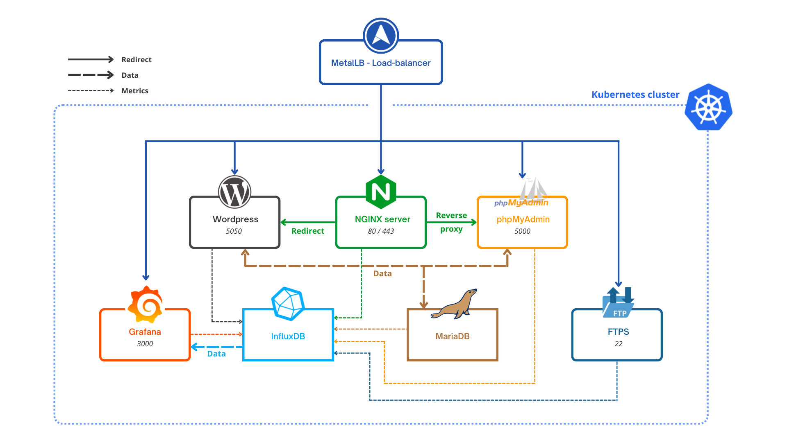
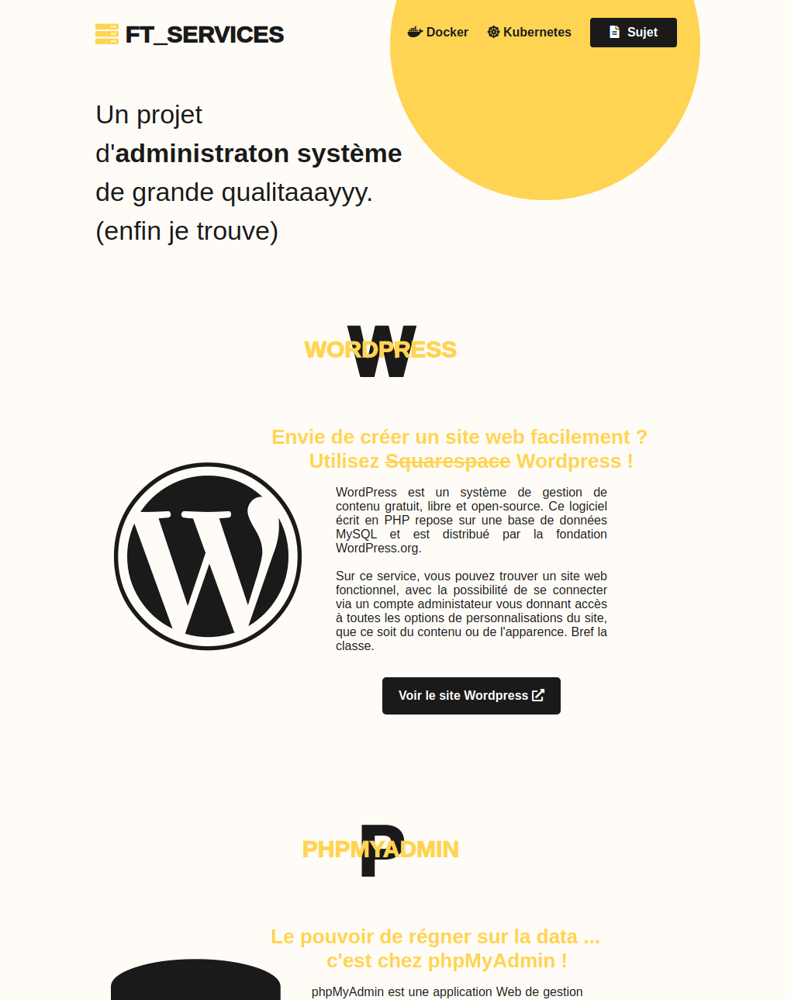

# :desktop_computer: 42_ft_services
A [42 school](https://www.42.fr/) project using [Kubernetes](https://kubernetes.io/fr/). It features a NGINX server, a WordPress website with its MariaDB database, phpMyAdmin for data management, Grafana to monitor the cluster's health, and InfluxDB to hold all the cluster's metric data.

#### Table of contents
1. [Usage](#%EF%B8%8F-usage)   
a. [Deploy](#deploy)    
b. [Technical considerations](#technical-considerations)
2. [Features](#-features)     
a. [Services](#services)    
b. [Ports](#ports)    
3. [Ressources](#-ressources)  
<br/>

<p align = "center"><i>Fig.1 - ft_services's cluster illustrated.</i></p>  

## 🛠️ Usage

### Deploy

```shell
# Launch the custom setup script to install everything and deploy the cluster
./setup.sh

# Run the script with the reset argument to shutdown and clean the cluster
./setup.sh -reset
```
### Technical considerations
This project was done on a VM - Linux distribution Ubuntu 10.04.5 LTS, provided by the school. Be aware that it may not work on another distribution.   
    
It uses [Minikube](https://kubernetes.io/fr/docs/setup/learning-environment/minikube/), a utility you can use to run Kubernetes on your local machine. It creates a single node cluster contained in a virtual machine (VM). Most problems regarding launching minikube on the school's VM can be solved using [@ashishae's recommandations](https://www.notion.so/Ft_services-VM-852d4f9b0d9a42c1a2de921e4a2ac417).    
    
> ⚠️ Note that this project was done as a learning experience in dev ops, with very specific specifications, and was not implemented with best practices in mind at all. It may stop working in the future and will not be maintained. Do not use it in production EVER.

<br/>

## 🔍 Features

The goal of this project is to learn about **_application deployment_** using Docker and Kubernetes to create a cluster of services working together, **_resilient_** to crashes and other bugs, with an easy **_monitoring_** solution. To that end, I created custom Dockerfiles for each services built on Alpine Linux with their appropriate configuration and deployment pipeline.

### Services

#### ⚖️ MetalLB
[MetalLB](https://github.com/metallb/metallb) is a load-balancer and the entryway to our cluster. Every connection from the outside goes through the load-balancer and redirects the requests to the appropriate service's port and pods depending on the cluster's current status. *(See Fig. 1)*

#### 🧭 NGINX 
To serve as a bridge between our two main apps, I used [NGINX](https://www.nginx.com/), an open source server. Its configuration dictate that every connection to the server via the 80 port is to be redirected systematicaly to the secure 443 port. It also features two routes, `/wordpress` with a 307 redirection to our website and `/phpmyadmin` with a reverse proxy to our admin app. I also added a custom landing page with links to our different services.

<p align="center"></p>
<p align = "center"><i>Fig.2 - A preview of NGINX's custom landing page.</i></p>

#### 🦭 Wordpress & MariaDB
[Wordpress](https://fr.wordpress.org/) is an open source CMS (Content Management System) with an easy to use website creation tool. Coupled with [MariaDB](https://mariadb.org/), an open source relational database, you can easily build a dynamic website with persistent data including blog posts, comments, multiple users with differents permissions etc ... In this project, the website has been built beforehand and its database is imported on deployment.

#### 📑 PhpMyAdmin
To manage our website data, we can choose to use the Wordpress native admin board or use [PhpMyAdmin](https://www.phpmyadmin.net/), a tool to manage SQL based databases like MariaDB. The data is accessed after login in with an admin account and is displayed in tables, easy to read and modify. It also features the possibility to use SQL statements directly in the software's interface.  
<p align = "center"></p>
<p align = "center"><i>Fig.3 - A phpMyAdmin example view.</i></p>   

#### 📂 FTPS
Another feature of our cluster is the [FTPS](https://en.wikipedia.org/wiki/FTPS) service that provide a secure way of transfering files to our server.

#### 🕵️ Grafana & InfluxDB & Telegraf
Finally, to monitor our cluster, we have a [Grafana](https://grafana.com/) service which can display real time data graphics. The cluster's metrics are stored in an [InfluxDB](https://www.influxdata.com/) database and fed to Grafana's different dashboard configured for each service after being collected by [Telegraf](https://www.influxdata.com/time-series-platform/telegraf/), a plugin of InfluxDB.
<p align = "center"></p>
<p align = "center"><i>Fig.4 - Grafana dashboard example (GitLab).</i></p>


### Ports
- NGINX : 80 (http) with a systemic redirection to 443 (https)
- Wordpress : 5050
- phpMyAdmin : 5000
- FTPS : 21
- Grafana : 3000

<br/>

## 📖 Ressources
Here's a little selection of useful links that helped me during this project.   
- [Kubernetes official documentation on deployment](https://kubernetes.io/fr/docs/concepts/workloads/controllers/deployment/)
- [Install MetalLB on Minikube](https://faun.pub/metallb-configuration-in-minikube-to-enable-kubernetes-service-of-type-loadbalancer-9559739787df)
- [Wordpress & MySQL deployment tutorial](https://medium.com/@containerum/how-to-deploy-wordpress-and-mysql-on-kubernetes-bda9a3fdd2d5)
- [Grafana official configuration documentation](https://grafana.com/docs/grafana/latest/administration/provisioning/#datasources?src=grafana_gettingstarted)
